<picture>
  <source media="(prefers-color-scheme: dark)" srcset="assets/banner-dark.svg">
  
</picture>

I build hardware that works in the field, not just on the bench.

Embedded Systems Technical Lead at [Maper](https://home.mapertech.com) — the firmware, electronics, and Thread mesh behind **10,000+ industrial vibration sensors**, from schematic to deployment.

### `// now`

- Scaling a **1,000+ node Thread mesh** on a single site (four channels, auto channel-scan firmware)
- Leading a next-gen sensor platform: rigid-flex PCB, injection-molded enclosure, lower-power sensing
- Contributing to [SimpleBLE](https://github.com/simpleble/simpleble), tinkering with [ESPHome home automation](https://github.com/tlifschitz/home-automation-esphome), and teaching browsers [how to hear in 3D](https://github.com/tlifschitz/hrtf)

### `// stack`

`C/C++` · `RTOS` · `Cortex-M4` · `DSP` · `Thread/Matter` · `PCB design` · `Python`

### `// reach me`

[tlifschitz.com](https://tlifschitz.com) · [linkedin](https://linkedin.com/in/tlifschitz) · [lifschitzt@gmail.com](mailto:lifschitzt@gmail.com)
